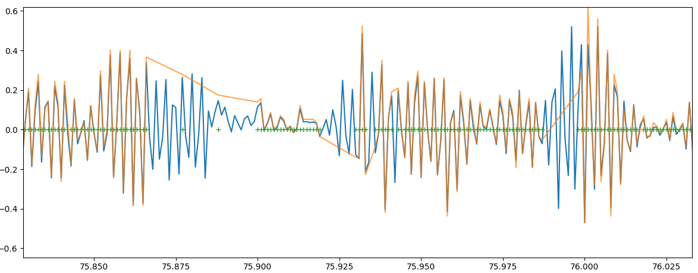

## What is this

Hawkeye is making a great for its cost 'naked' camera with gyro data logging.
Unfourtenately, the gyro data has holes in it. This script attempts to fill them with predicted data.

This is how the result looks on graphs. Orange line connects actual source samples, blue line is the script output, green pluses show time points where actual data is availible.

## Usage

1. Install required python dependencies
2. Run `python main.py <your hawkeye csv file>.csv <output csv name>.csv`

