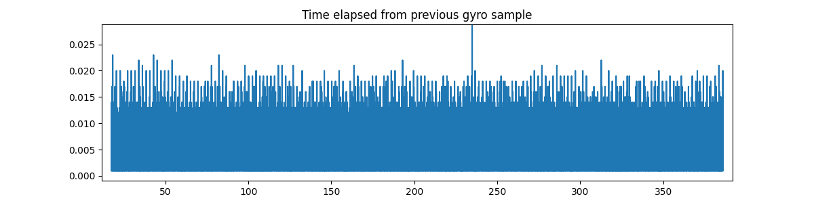
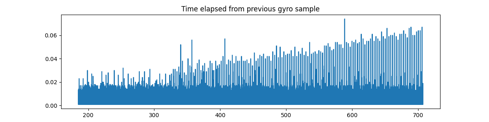

# THIS repo contents are OBSOLETE
Hawkeye has released a new firmware v4.0. Gyro logs from this firmware do not have holes in them, so these scripts will only make the data worse.
The data is still non-ideal (it has some nasty spikes if you hard-mount the camera to a drone), but more or less usable if the camera is soft-mounted.

## What is this

Hawkeye is making a great for its cost 'naked' camera with gyro data logging.
Unfourtenately, the gyro data has holes in it. This script attempts to fill them with predicted data.

This is how the result looks on graphs. Orange line connects actual source samples, blue line is the script output, green pluses show time points where actual data is availible.

## How to get a good gyro log
The quality of the gyro log depends at least on these factors: sd card IOPS, is it EXFAT of FAT32 formatted and filesystem cluster size.
That's what you can do to get best possible logs

### Correctly format your SD card
**Format your SD card with EXFAT**. Even if it is <= 32GB, do that. Exfat is simply faster.
**Choose a large cluster size preferrably 1024 KB**. For some reason `lite_config.txt` does not work on large cluster sizes. Prepare to use a second SD-card for that or use Wi-Fi app.

### Choose an SD card rated for high IOPS
Buy an **application performance-class rated SD-card**. There are two classes, A1 and A2. A2 is advertised to be faster, but **DO NOT BUY A2 CLASS CARDS**.
Even if the seller says they are faster.
They are better only if the host complies with a very recent SD physical layer spec, and if used in older hosts often underperform the A1 class.

One good choice is **SDSQXAF-032G-GN6MA** from SanDisk.

### Other notes
You can also try disabling the thumbnail video stream (the one with AB suffix, but I have not tested the impact of this change).

## Usage

1. Install required python dependencies
2. Run `python main.py <your hawkeye csv file>.csv <output csv name>.csv`

## How to check your gyro log quality

There's a script called `analyze.py`, it shows a plot of time vs time from previous gyro sample.
It takes the name of your log as an argument. If most of the peaks in the log are less than 0.025 than we say that it is a good log.

A more or less **GOOD** log looks like that:

It has been logged on Sandisk Extreme A1 32GB

And a **BAD** log looks something like that:

It has been logged on Sandisk Extreme Pro A2 128GB

So we see that a more expensive SD card is not a better card.